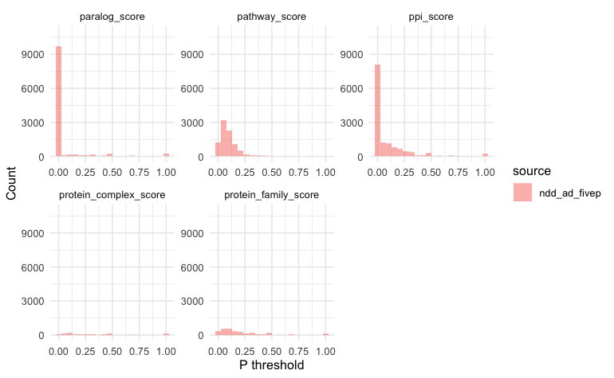
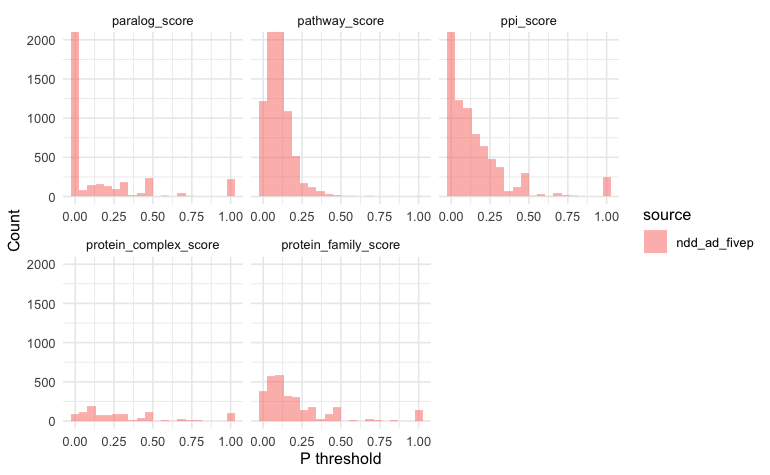
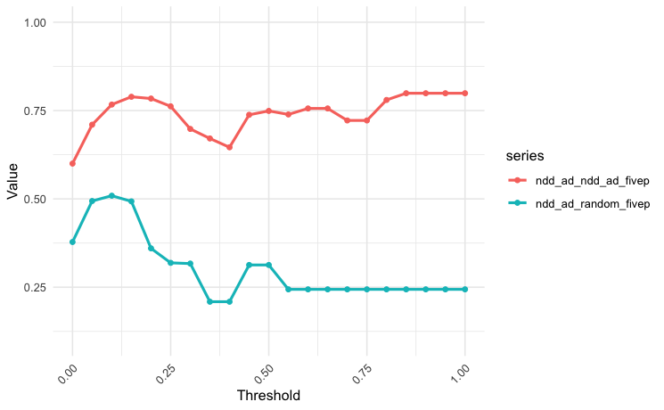
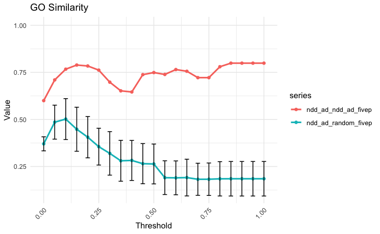

# fiveP-ml

fiveP is a package created to identify protein coding genes similar to a user-defined set of input or seed genes, based on four protein annotations and paralog status. The five 'Ps' are: protein complex, protein family, pathways, protein-protein interactions (PPI), and paralog.

The package identifies similar genes by computing similarity ratios for each individual P.

The similarities are calculated with the following equations, where the higher the score (between 0 and 1), the more similar that gene is to the input genes:

#### Protein complexes, Protein families, Pathways

Using pathways as the example P: For each protein coding gene, the number of unique input genes in input gene pathways, divided by the number of unique genes in input gene pathways.

$$
r(g)=\frac{|S\cap P(S)|}{|P(S)|}
$$

#### Paralogs, PPI

Using PPI as the example: For each protein coding gene, the number of input genes that gene interacts with, divided by the number of genes it interacts with:

$$
r(g)=\frac{|P(g)\cap S|}{|P(g)|}
$$

#### Usage

The package can be used with one function, `get_fiveP()`, or with individual functions for each step of the workflow. Examples are below.

The output is always for all protein coding genes. Depending on how the package is used, the user can get ratios for all fivePs or for whatever Ps they select.

The output of the fiveP can be kept as similarity ratios, where the higher the ratio the more similar that gene is to the input genes. Or, it can be turned into a binary score, which simply states whether that gene is in the same P/interaction/paralog with any of the input genes.

For the genes without data, a 'NA' is left in its place.

### Quick start / Installation

#### Dependencies

-   devtools

-   dplyr (2.5.0)

-   purrr (1.0.2)

-   tidyr (1.3.1)

-   magrittr (2.0.3)

-   readr

-   STRINGdb (2.18.0)

-   biomaRt (2.62.0)

#### Install package

`devtools::install_github("martadelfino/fiveP-ml")`

#### Load package

`library(fivePml)`

#### Examples

1.  The `get_fiveP()` function

The `get_fiveP()` function is the easiest way to get a df with all five Ps. (Please note: if you get a connection error at any point, restart the session and try again. This may be due to one of the packages or file locations.)

```{r}

input_genes <- tibble(hgnc_id = c("HGNC:19743", 
                                  "HGNC:9202",
                                  "HGNC:8653",
                                  "HGNC:6936",
                                  "HGNC:4878"))

result <- get_fiveP(input_genes, binary = FALSE) # binary = FALSE will give scores of 0 or 1.
head(result)
#>      hgnc_id protein_complex_score protein_family_score pathway_score
#> 1 HGNC:19743                     1                    1    0.02702703
#> 2  HGNC:9202                     1                    1    0.02702703
#> 3  HGNC:4879                     1                    1    0.01449275
#> 4  HGNC:8654                     1                   NA    0.15384615
#> 5  HGNC:6937                     1                   NA    0.06896552
#> 6  HGNC:8653                     0                    1    0.07692308
#>   paralog_score  ppi_score
#> 1           1.0 0.04545455
#> 2           1.0 0.00000000
#> 3           1.0 0.05263158
#> 4           0.0 0.00000000
#> 5           0.0 0.06250000
#> 6           0.5 0.00000000
```

2.  Running the workflow steps manually

However, it is also possible to get one P at a time. The workflow is separated into three main steps:

1.  Data fetching
2.  Data processing / ratio calculations
3.  Merging

(Please note: if you get a connection error at any point, try that function again. You may need to restart the session.)

```{r}
# 1. Data fetching functions ----------------------------------------------------
# First, all protein coding genes are obtained
hgnc_gene_list <- fetch_hgnc_gene_list()
# Then the five P are obtained. Some functions require the input genes at this step. 
paralogs <- fetch_paralogs(hgnc_gene_list)
pathways <- fetch_pathways(hgnc_gene_list, input_genes)
ppi <- fetch_ppi(hgnc_gene_list)
# (Accessing UNIPROT is required for the protein complex and protein families step)
uniprot <- fetch_uniprot(hgnc_gene_list, input_genes)
protein_complex <- fetch_protein_complex(hgnc_gene_list, uniprot)
protein_families <- fetch_protein_families(hgnc_gene_list, uniprot)

# 2. Data processing functions --------------------------------------------------
# Second, the functions for the ratio calculations. 
# Some functions require the input genes at this step.
paralogs_ratio <- calculate_paralogs_ratio(paralogs, input_genes)
pathways_ratio <- calculate_pathways_ratio(
  pathways$input_genes_Uniprot2Reactome,
  pathways$Uniprot2Reactome_final_hgnc_no_na,
  input_genes
)
ppi_ratio <- calculate_ppi_ratio(ppi, input_genes)
protein_complex_ratio <- calculate_protein_complex_ratio(protein_complex, input_genes)
protein_families_ratio <- calculate_protein_families_ratio(protein_families, input_genes)

# 3. Merging everything ---------------------------------------------------------
# Then all fiveP are meregd. Any of the fiveP can be selected.  
protein_coding_genes <- hgnc_gene_list %>%
  dplyr::select(hgnc_id)
input_genes <- input_genes %>%
  dplyr::select(hgnc_id)
protein_complexes <- protein_complex_ratio %>%
  dplyr::select(hgnc_id, ratio_input_genes_in_complexes)
protein_families <- protein_families_ratio %>%
  dplyr::select(hgnc_id, ratio_input_genes_in_families)
pathways <- pathways_ratio %>%
  dplyr::select(hgnc_id, ratio_input_genes_in_pathways)
paralogs <- paralogs_ratio %>%
  dplyr::select(hgnc_id, ratio_paraloginputgenes_to_paralogs)
ppi <- ppi_ratio %>%
  dplyr::select(hgnc_id, ratio_interactioninputgenes_to_interactions)

list_of_dfs <- list(
  protein_coding_genes, protein_complexes, protein_families,
  pathways, paralogs, ppi
)

results <- list_of_dfs %>%
  purrr::reduce(left_join, by = "hgnc_id") %>%
  dplyr::rename(protein_complex_score = ratio_input_genes_in_complexes) %>%
  dplyr::rename(protein_family_score = ratio_input_genes_in_families) %>%
  dplyr::rename(pathway_score = ratio_input_genes_in_pathways) %>%
  dplyr::rename(paralog_score = ratio_paraloginputgenes_to_paralogs) %>%
  dplyr::rename(ppi_score = ratio_interactioninputgenes_to_interactions) %>%
  arrange(
    desc(protein_complex_score), desc(protein_family_score),
    desc(pathway_score), desc(paralog_score), desc(ppi_score)
  )

# Optional: turning the ratios into binary scores -------------------------------
results_binary <- results %>%
  dplyr::mutate(across(ends_with("_score"), ~ ifelse(. > 0, 1, 0)))

```

4.  Plotting fiveP distributions with `fivep_distribution_plot()` or `fivep_distribution_plot_zommedin()`

```{r}
# Example: ndd_ad_fivep has an "id" column + 5 numeric columns. You can add as many fiveP result dfs as you'd like in the list. 
dis_plots <- list(ndd_ad_fivep = ndd_ad_fivep)

inputgene_fivep_dist_plot <- fivep_distribution_plot(dis_plots, bins = 20)
inputgene_fivep_dist_plot_zoomedin <- fivep_distribution_plot_zoomedin(dis_plots, bins = 20)
inputgene_fivep_dist_plot 
inputgene_fivep_dist_plot_zoomedin
```

fiveP distribution plot:



fiveP distribution plot zoomed in:



(Please note: you will get a warning such as: *Warning: [38;5;250mRemoved 58955 rows containing non-finite outside the scale range (`stat_bin()`).[39m.* This is because the results will have NAs in each column.)

5.  Checking your fiveP results are statistically significant - comparing input gene list fiveP to 100 random gene list fivePs (GO term enrichment, GO term similarity, Wilcoxon Signed Rank test).

In order to ensure your input gene list fiveP results are significant, you can calculate the GO term similarity of your input gene list, versus the input gene list fiveP and random gene lists fiveP results. This means, once you have the fiveP for your input gene list, you can do the following steps:

1.  Creating random gene lists, and get fiveP for each.
2.  Calculate GO term enrichment for your input gene list, input gene list fiveP, and random gene list fivePs, at various fiveP thresholds.
3.  Calculate GO term similarity between: input gene list enriched GO terms & input gene list fiveP enriched GO terms, input gene list enriched GO terms & random gene list enriched GO terms. You can do this at various fiveP thresholds.
4.  Calculate Wilcoxon Signed Rank Test for the GO similarity scores obtained at step 3.

Example of GO Similarity with ONE random gene list only:

```{r}
# Step 1 --------------------------------------------------------------------------
## You've created the random gene list, you obtained fiveP for the random gene list and for 
## the input gene list. 

# Input gene list
ndd_ad # Just a df with one hgnc_id column

# Input gene list fiveP
ndd_ad_fivep # get_fiveP() output

# Random gene list fiveP
random_gene_list_fivep # get_fiveP() output


# Step 2 --------------------------------------------------------------------------
## Now, you need to obtain the GO term enrichment for input gene list, input fiveP gene list
## (at many fiveP thresholds), and random gene list fiveP (at many fiveP thresholds)

# defining the fiveP thresholds 
filter_positive_thresholds <- function(df) {
  thresholds <- seq(0, 1, by = 0.05)
  
  lapply(thresholds, function(th) {
    if (th == 0) {
      df %>%
        dplyr::filter(if_any(-hgnc_id, ~ .x > 0)) %>%
        dplyr::select(hgnc_id)
    } else if (th == 1) {
      df %>%
        dplyr::filter(if_any(-hgnc_id, ~ .x == 1)) %>%
        dplyr::select(hgnc_id)
    } else {
      df %>%
        dplyr::filter(if_any(-hgnc_id, ~ .x >= th)) %>%
        dplyr::select(hgnc_id)
    }
  }) %>%
    setNames(paste0("threshold_", thresholds))
}

# Apply it to the input gene list and random gene list 
random_gene_list_fivep_thresholds <- filter_positive_thresholds(random_gene_list_fivep)
ndd_ad_fivep_thresholds <- filter_positive_thresholds(ndd_ad_fivep)

# GO Term enrichment function
go_enrichment_function <- function(hgnc_id_column) {
  vector_hgnc_id <- pull(hgnc_id_column)
  ensembl <- useEnsembl(biomart = "genes", dataset = "hsapiens_gene_ensembl")
  mapped_hgnc_id <- getBM(attributes = c("hgnc_id", "entrezgene_id", "external_gene_name"),
                filters = "hgnc_id",
                values = vector_hgnc_id,
                mart = ensembl)
  head(mapped_hgnc_id)
  entrez <- pull(mapped_hgnc_id, entrezgene_id)
  head(entrez)
  go_results <- enrichGO(gene = entrez,
                       OrgDb        = org.Hs.eg.db,
                       keyType      = "ENTREZID",
                       ont          = "BP",
                       pAdjustMethod = "BH",
                       pvalueCutoff  = 0.05,
                       qvalueCutoff  = 0.2,
                       readable      = TRUE)
  #head(go_results)
  return(go_results)
}

# Apply it to all thresholds of input gene list fiveP and random gene list fiveP
random_gene_list_fivep_thresholds_goenrich <- lapply(random_gene_list_fivep_thresholds, go_enrichment_function)
ndd_ad_fivep_thresholds_goenrich <- lapply(ndd_ad_fivep_thresholds, go_enrichment_function)

# Apply it to input gene list
ndd_ad_go_enrich <- go_enrichment_function(ndd_ad)


# Step 3 --------------------------------------------------------------------------
## Next, calculate GO term similarity between the GO term enrichment results. The similarity
## is computed betwee: 1. input gene list & input gene list fiveP and
## 2. input gene list & random gene list fiveP

# GO similarity function 
hsGO <- godata('org.Hs.eg.db', ont="BP")
go_similarity_function <- function(go_list1, go_list2, p_value = TRUE, p_adjust = 0.05, n_count = 20, measure = "Wang", combine = "BMA") {
  # Work on the enrichment results directly
  go_df1 <- go_list1@result
  go_df2 <- go_list2@result
  
  # Apply p-value filtering if requested
  if (p_value) {
    go_df1 <- go_df1 %>% dplyr::filter(p.adjust < p_adjust)
    go_df2 <- go_df2 %>% dplyr::filter(p.adjust < p_adjust)
  }
  
  # Now select top terms
  go_ids1 <- go_df1 %>%
    dplyr::slice_max(order_by = Count, n = n_count) %>%
    dplyr::pull(ID)
  
  go_ids2 <- go_df2 %>%
    dplyr::slice_max(order_by = Count, n = n_count) %>%
    dplyr::pull(ID)
  
  # Compute similarity
  sim_score <- mgoSim(go_ids1, go_ids2, semData = hsGO, 
                      measure = measure, combine = combine)
  
  return(sim_score)
}

# GO similarity between gene lists 
random_gene_list_fivep_thresholds_gosim <- lapply(random_gene_list_fivep_thresholds_goenrich, 
                                                  function(x) go_similarity_function(ndd_ad_go_enrich,x,p_value = TRUE))
ndd_ad_fivep_thresholds_gosim <- lapply(ndd_ad_fivep_thresholds_goenrich, 
                                        function(x) go_similarity_function(ndd_ad_go_enrich,x,p_value = TRUE))


# Step 4 --------------------------------------------------------------------------
## Plot the GO similarity results

thresholds <- sprintf("%.2f", seq(0, 1, by = 0.05))
df <- data.frame(
  threshold_label = thresholds,
  ndd_ad_random_fivep = as.numeric(random_gene_list_fivep_thresholds_gosim),
  ndd_ad_ndd_ad_fivep = as.numeric(ndd_ad_fivep_thresholds_gosim)
)

ndd_ad_fivep_random_fivep_gosim_plot <- plot_go_similarity_1v1(df)
```

Example of input gene list & one random gene list:



If you wanted to calculate the Wilcoxon Signed Rank test, you would need to create multiple random gene lists and do this process for each random gene list. Then, you could use the `plot_go_similarity_1vmany()` plotting function. Example of input gene list & many random gene lists:



(all 0s are removed to calculate mean and sd from random gene list fivep line)

With multiple random gene lists, the Wilcoxon Signed Rank test can be used to evaluate the statistical significance of your input gene list fiveP results, compared to random gene lists fiveP results.

Example of Wilcoxon Signed Rank Test:

```{r}
wilcox.test(ndd_ad_ndd_ad_fivep, ndd_ad_random_fivep, paired = TRUE)

#> Warning: cannot compute exact p-value with ties
#> 	Wilcoxon signed rank test with continuity correction
#> 
#> data:  ndd_ad_ndd_ad_fivep and ndd_ad_random_fivep
#> V = 231, p-value = 6.33e-05
#> alternative hypothesis: true location shift is not equal to 0

```

### Other comments

License is GPL (\>= 3) because for PPI, we use STRINGdb, which has GLP 2 license.
